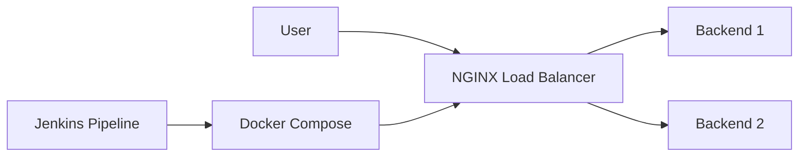
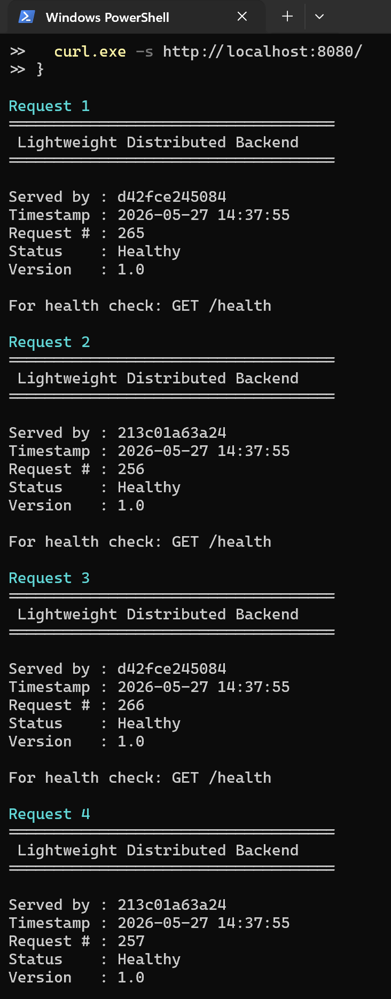

# Distributed Backend with Docker, Jenkins and NGINX

A simple lab program demonstrating containerized backend services, load balancing using NGINX, and CI/CD automation with Jenkins.

---

## Overview

This project runs two C++ backend containers behind an NGINX reverse proxy using Docker Compose. Jenkins is used to automate build and deployment steps.

The setup demonstrates:

- Docker containerization
- NGINX reverse proxying
- Basic load balancing
- Docker Compose orchestration
- Jenkins pipeline automation
- Health checks between services

---

## Architecture



---

## Project Structure

```text
.
├── backend/
│   ├── app.cpp
│   └── Dockerfile
├── nginx/
│   └── default.conf
├── docker-compose.yml
├── Jenkinsfile
├── Dockerfile.jenkins
├── Makefile
└── README.md
```

---

## Running the Project

### Start services

```bash
docker compose up -d
```

### Check running containers

```bash
docker compose ps
```

### Test the load balancer

```bash
curl http://localhost:8080/
```

### Health check

```bash
curl http://localhost:8080/health
```

### Stop services

```bash
docker compose down
```

---

## Makefile Commands

```bash
make build
make up
make health
make demo
make logs
make down
```

---

## Example Output

```text
====================================
 Lightweight Distributed Backend
====================================

Served by : backend1
Timestamp : 2026-05-27 14:22:11
Request # : 52
Status    : Healthy
Version   : 1.0
```

---

## Demo

The screenshot below shows requests being distributed between backend containers through the NGINX load balancer.



---

## Ports

| Service             | Port |
| ------------------- | ---- |
| NGINX Load Balancer | 8080 |
| Backend 1           | 8081 |
| Backend 2           | 8082 |

---

## Notes

- Port `8080` is used for NGINX on Windows to avoid host port conflicts.
- Health checks are configured for backend containers and NGINX.
- Docker Compose manages networking and service startup order.

---

## Technologies Used

- C++
- Docker
- Docker Compose
- Jenkins
- NGINX

---
